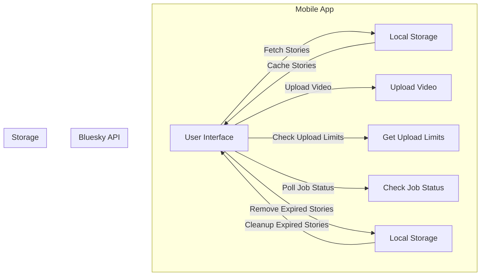
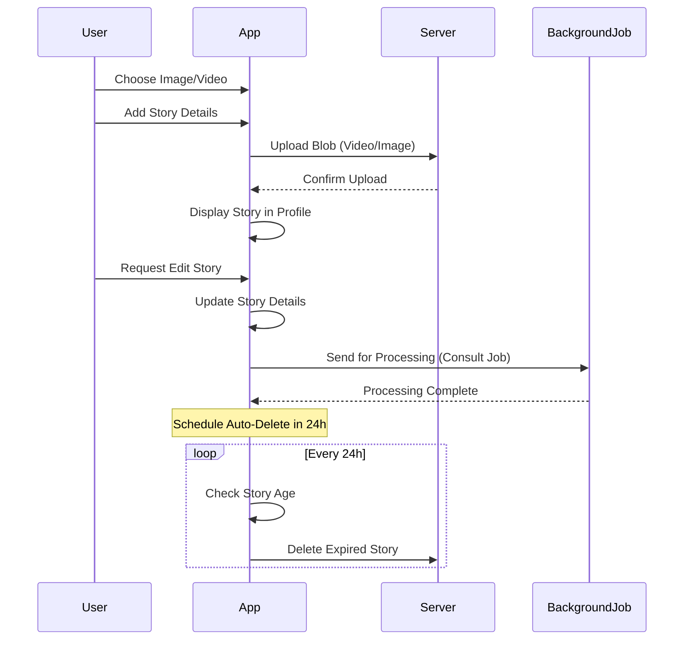

# Implementing Stories Feature in React Native Expo (Client-Side Only)

## Overview

This document outlines an initial approach to implementing a Stories feature similar to Instagram Stories, entirely on the client side, using the Bluesky API. This implementation avoids a dedicated backend and relies solely on the client to manage story uploads, retrieval, and expiration.

## Features

- **Display stories from followed users** in a vertical list.
- **Upload new stories** with video support.
- **Automatically remove stories after 24 hours**.
- **Cache stories locally** for better performance.

## API Endpoints Used

1. **Fetch Stories**: No direct endpoint; stories must be inferred from posts.
2. **[Upload Video](https://docs.bsky.app/docs/api/app-bsky-video-upload-video)**
3. **[Get Upload Limits](https://docs.bsky.app/docs/api/app-bsky-video-get-upload-limits)**
4. **[Check Job Status](https://docs.bsky.app/docs/api/app-bsky-video-get-job-status)**

---

## Implementation Plan

### 1. Fetching Stories

- Retrieve a list of followed users.
- Fetch recent posts from these users, filtering posts that contain video attachments.
- Store fetched stories in local storage to avoid unnecessary API calls.

### 2. Uploading a Story

1. Check upload limits via `getUploadLimits`.
2. Upload video using `uploadVideo`.
3. Poll `getJobStatus` until processing is complete.
4. Post the processed video as a status update.
5. Store metadata (timestamp, user, etc.) locally for expiration tracking.

### 3. Displaying Stories

- Render a scrollable vertical list at the top of the screen.
- Differentiate between **new** and **viewed** stories.
- Mark stories as viewed locally after opening.

### 4. Handling Expiration

- Use a timestamp to determine when a story was posted.
- Remove expired stories from local storage after 24 hours.
- Optionally, re-fetch stories periodically to stay updated.

---

## C4 Diagram (Mermaid)

---

## Next Steps

- Build UI components for displaying stories.
- Implement API calls and integrate local storage.
- Optimize fetching and caching logic.
- Add user interactions (e.g., tap to view, swipe to skip).

This approach ensures a lightweight, client-only solution without a dedicated backend. Would you like to extend it with additional functionalities such as reactions or story analytics?
